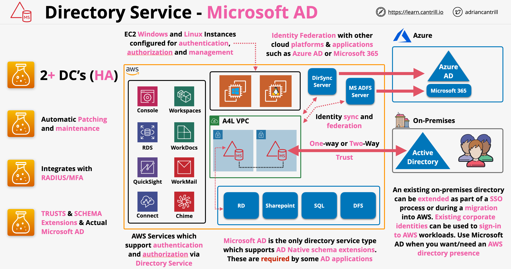

# Microsoft AD (Directory Services)

- Built using a native Microsoft Active Directory implementation
- Running fully independently of any on-premises Active Directory
- Can be managed by using Standard Active Directory tools
- Supports unique features of Microsoft Active Directory, such as Group Policy and Single Sign-On (SSO)
- Using standard Microsoft Active Directory Schema (a way of describing how the database is structured)
- Supports extensions to that schema for applications which require it, such as Sharepoint, Microsoft SQL Server, or Distributed File System (DFS)
- Used for Active Directory Authentication/Authorisation of products/services within AWS (e.g., Workspaces, RDS, etc.)
- Comes in two sizes:
  - Standard: Supports up to 30,000 objects
  - Enterprise: Supports up to 500,000 objects
- High-Availability by default (gets deployed in at least two Availability Zones)
- ENIs are injected into subnets within a customer-created VPC which belongs to one of the domain controller
- Domain controllers replicate data between each other
- The service is managed by AWS and includes configurable monitoring, recovery, replication, snapshots and maintenance
- Automatic patching and maintenance
- Supports trust between it and other on-premises Active Directories
- Supports RADIUS-based MFA by integrating into already existing RADIUS infrastructure
- Best choice if a directory is required which supports more than 5,000 users and for which a trust relationship between AWS and an existing on-premises Active Directory infrastructure is required
- Workloads in AWS can continue to operate if a network link to the on-premises environment fails

## Microsoft AD Architecture

